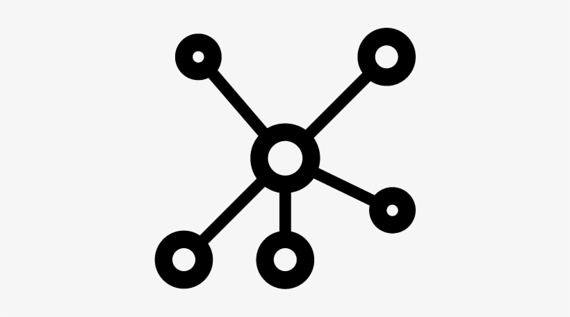

<!--  -->
  <h1>🌐 Network Simulator</h1>
  
<i>Leer de basis van netwerkarchitectuur, bekabeling en IP-configuratie op een interactieve manier.</i>

---

## 🎮 Over het Project

Welkom bij de **Network Simulator**! Deze game is ontworpen om studenten en enthousiastelingen wegwijs te maken in de
wereld van netwerken. Van het trekken van de juiste kabels tot het configureren van wereldwijde verbindingen.

### 📚 Level Uitleg

| Level       | Thema           | Wat je leert                                                         |
| :---------- | :-------------- | :------------------------------------------------------------------- |
| **Level 1** | 🔌 LAN & Kabels | Het verschil tussen Cat 5 en Cat 5e en de impact van afstand.        |
| **Level 2** | 🛠️ Routing & IP | Handmatige IP-configuratie en het instellen van een Default Gateway. |
| **Level 3** | 🌍 WAN & Wi-Fi  | Wereldwijde verbindingen via Fiber en draadloze netwerken opzetten.  |

---

## ⌨️ Bediening & Sneltoetsen

In de simulator kun je gebruikmaken van de volgende knoppen om je netwerk op te bouwen:

- **[1] PC**: Plaats een vaste werkplek.
- **[2] Laptop**: Voor mobiele apparaten (Kabel of Wi-Fi).
- **[3] Switch**: Het centrale punt voor je lokale netwerk.
- **[4] Router**: Verbind verschillende netwerken met elkaar.
- **[D] Verwijderen**: Activeer de verwijder-modus voor kabels of apparaten.
- **[SPATIE]**: Verstuur een test-datapakketje.

> **Tip:** Dubbelklik op een apparaat om het "OS-menu" te openen voor IP-instellingen en de webbrowsersimulatie.

---

## 🛠️ Developer Shortcuts

Voor snelle tests kun je de volgende combinaties gebruiken:

- **Level Skip**: Houd `F` + `K` gedurende 2 seconden ingedrukt om direct naar Level 3 te springen.
- **Auto-fill**: Dubbelklik op IP-invoervelden voor snelle standaardwaarden.

---

## 💡 Tips voor Succes

1.  **Kleurcodes**: Een rode kabel betekent dat de afstand te groot is. Gebruik een Switch als versterker of stap over
    op Cat 5e/Fiber.
2.  **Internetverbinding**: Geen toegang tot de website? Controleer of je PC in hetzelfde subnet zit als de router
    (bijv. `192.168.1.x`).
3.  **Wi-Fi Bereik**: Laptops moeten binnen de blauwe cirkel van de router staan om verbinding te maken.

---

## 🔗 Links

- 🐙 [GitHub Repository](https://github.com/itfactory-tm/2025-2026-1itf-1-webdesign-essentials-ThomasDeTreinA)
- 📸 [Pexels Portfolio](https://www.pexels.com/nl-nl/@thomas-2155811062/)

---

  
Gemaakt door ThomasDeTreinA - 2026

